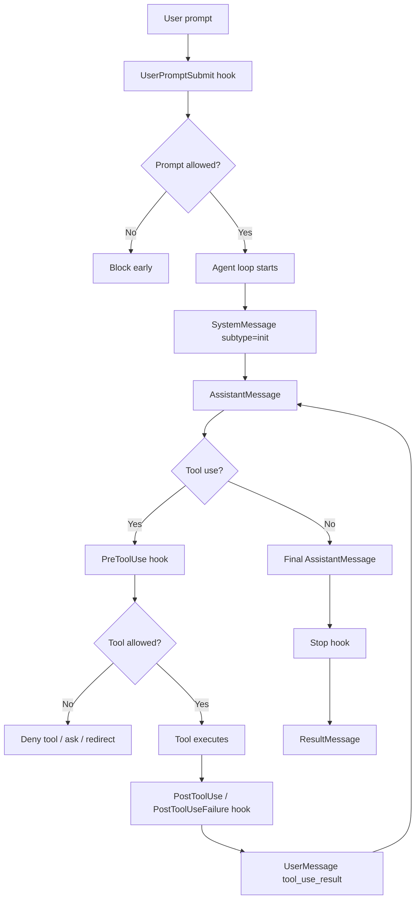
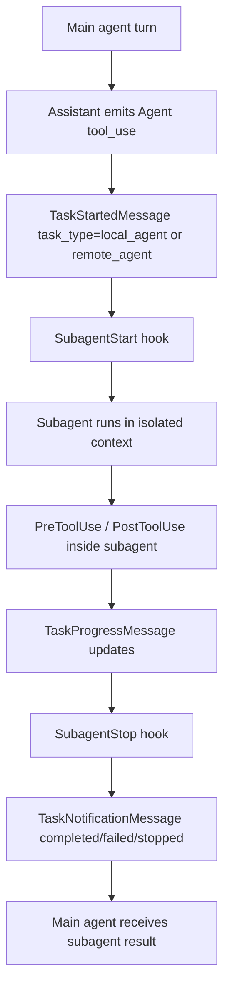
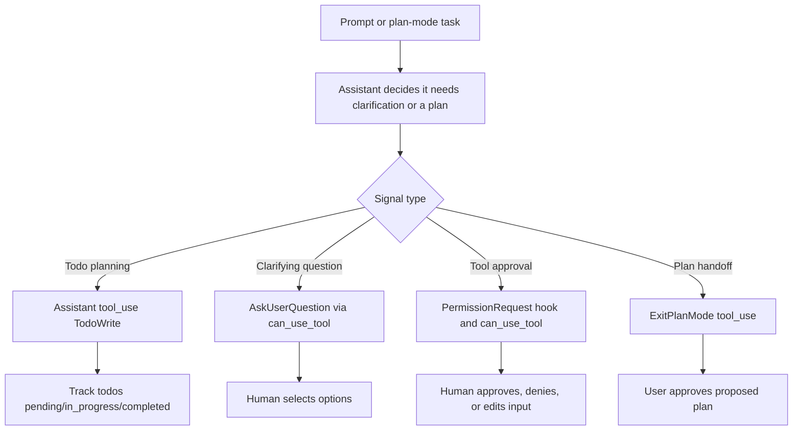

# Claude Agent SDK Event Matrix for Aiceberg Monitoring

Last updated: 2026-03-24

## Purpose

This document answers four practical questions for a Python-based Aiceberg integration on top of the Claude Agent SDK:

1. What events and signals does Claude expose today?
2. Which of them are native and enforceable, and which are only inferable?
3. How do subagents, planning, thinking, notifications, and human feedback fit into the model?
4. How should we map those signals into Aiceberg event types and safety decisions?

This is focused on the **Python Claude Agent SDK** first, with notes where TypeScript has broader coverage.

## Executive Summary

The Python Claude Agent SDK gives us strong observability and control over:

- user prompt submission
- tool calls and tool results
- permission requests
- notifications
- subagent start/stop
- background task progress
- todo/planning signals
- final result and stop reason

The main gap versus Strands is still model-call visibility:

- Strands exposes native `BeforeModelCall` and `AfterModelCall`
- Claude Python does **not** expose an equivalent `BeforeModelCall` / `AfterModelCall` hook pair
- for Claude, `agent_llm` is best treated as a **derived event** built from `AssistantMessage`, `UserMessage.tool_use_result`, transcript paths, and the agent loop

So the clean design is:

- native monitoring for `user_agt`, `agt_tool`, `agt_agt`, approvals, and lifecycle
- derived monitoring for `agt_llm`, planning, and thinking

## High-Level Lifecycle

## Multi-Agent / Subagent Lifecycle

## Planning / Human Feedback Lifecycle

## Observability Surfaces

Claude exposes observable behavior through four main surfaces:

1. Hook callbacks
2. Streamed SDK messages
3. Message content blocks
4. Permission callbacks and runtime approval flow

For Aiceberg, we should treat these differently:

- hooks are best for enforcement and deterministic boundaries
- streamed messages are best for live telemetry and derived model-turn monitoring
- content blocks are best for extracting thinking, tool-use, and todo signals
- permission callbacks are best for human-in-the-loop auditing

## Event Matrix

### A. Hook Events

| Claude signal | Python SDK | Trigger | Blockable / controllable | Useful payload | Best Aiceberg mapping | Notes |
|---|---|---|---|---|---|---|
| `UserPromptSubmit` | Yes | User submits prompt | Yes | `prompt`, `session_id`, `cwd`, `transcript_path` | `user_agt` input | Earliest deterministic prompt boundary |
| `PreToolUse` | Yes | Tool about to run | Yes | `tool_name`, `tool_input`, `tool_use_id`, optional `agent_id`, `agent_type` | `agt_tool`, `agt_agt`, `agt_mem` input | Primary safety gate for tool execution |
| `PostToolUse` | Yes | Tool returned successfully | Partly; can inject context | `tool_name`, `tool_response`, `tool_use_id`, optional subagent fields | matching output event | Good for output safety, logging, analytics |
| `PostToolUseFailure` | Yes | Tool failed | No retroactive prevention | `tool_name`, `tool_input`, `tool_use_id`, `error` | matching output event with failure metadata | Close open tool events cleanly |
| `PermissionRequest` | Yes | Claude would show approval dialog | Yes | `tool_name`, `tool_input`, `permission_suggestions` | `human_feedback` request or approval audit | Strong signal for human-in-loop |
| `Notification` | Yes | Agent emits runtime notification | No direct blocking | `notification_type`, `message`, optional `title` | `agent_notification` or metadata-only | Useful for UI or alerting |
| `Stop` | Yes | Main agent execution is stopping | Mostly no; use as finalization boundary | `stop_hook_active`, shared base fields | finalize `user_agt`, derive `agt_llm` | Good place to flush state |
| `SubagentStart` | Yes | Subagent initialized | No execution control | `agent_id`, `agent_type` | `agt_agt` lifecycle open | Strong correlation point |
| `SubagentStop` | Yes | Subagent completed | Mostly no; good finalization point | `agent_id`, `agent_type`, `agent_transcript_path`, `stop_hook_active` | `agt_agt` lifecycle close, derived `agt_llm` | Best subagent completion hook |
| `PreCompact` | Yes | Session compaction requested | Yes, via context injection / behavior control | `trigger`, `custom_instructions` | `context_compaction` | Useful for transcript archiving |
| `SessionStart` | Callback hook: No | Session init | Not as Python callback | shell-hook only via settings | `session_lifecycle` | Python caveat |
| `SessionEnd` | Callback hook: No | Session end | Not as Python callback | shell-hook only via settings | `session_lifecycle` cleanup | Python caveat |

### B. Streamed SDK Message Types

| Claude signal | Python SDK | Meaning | Best use | Best Aiceberg mapping | Notes |
|---|---|---|---|---|---|
| `SystemMessage` | Yes | Metadata/system lifecycle message | capture init metadata, session metadata | `session_lifecycle` metadata | `subtype="init"` is the first useful session signal |
| `AssistantMessage` | Yes | Model turn containing text and/or tool calls | derive `agt_llm` output; inspect content blocks | `agt_llm` output | Most important model-turn signal |
| `UserMessage` | Yes | User input or tool-result continuation | derive `agt_llm` input; detect tool-result feedback | `agt_llm` input or tool continuation metadata | `tool_use_result` and `parent_tool_use_id` matter |
| `ResultMessage` | Yes | Final outcome, usage, cost, stop reason | close user turn, capture billing and outcome | `user_agt` output + run summary | Strong finalizer |
| `StreamEvent` | Yes if `include_partial_messages=True` | Raw partial stream event | incremental UI, partial reasoning display, live telemetry | low-level telemetry | Best for advanced observability |
| `TaskStartedMessage` | Yes | Background task started | monitor subagents, background bash, remote agents | `task_lifecycle` open | Includes `task_type` |
| `TaskProgressMessage` | Yes | Background task progress update | progress bars, token and tool usage | `task_progress` | Great for long-running multi-agent jobs |
| `TaskNotificationMessage` | Yes | Background task completed / failed / stopped | task completion analytics | `task_lifecycle` close | Includes summary, output file, usage |

### C. Content Blocks Inside Messages

| Claude signal | Python SDK | Where it appears | Best use | Best Aiceberg mapping | Notes |
|---|---|---|---|---|---|
| `TextBlock` | Yes | `AssistantMessage.content` / `UserMessage.content` | visible text payload | `user_agt` / `agt_llm` content | Basic text extraction |
| `ThinkingBlock` | Yes | `AssistantMessage.content` when thinking is enabled | derived thinking analytics | `agent_thinking` or metadata-only | Valuable but sensitive |
| `ToolUseBlock` | Yes | `AssistantMessage.content` | detect tool calls including `Agent`, `TodoWrite`, `ExitPlanMode`, `AskUserQuestion` | `agt_tool` / `agt_agt` / planning metadata | Strong derived signal |
| `ToolResultBlock` | Yes | `UserMessage.content` or tool continuation | connect results back into next model turn | tool continuation metadata | Helps reconstruct `agt_llm` input |

### D. Important Built-In Tools That Behave Like Events

| Tool | Meaning | Why it matters for observability | Suggested mapping |
|---|---|---|---|
| `Agent` | Spawn a subagent | This is the orchestration primitive for multi-agent work | `agt_agt` |
| `AskUserQuestion` | Claude asks a clarifying question | Human-feedback and requirements-capture boundary | `human_feedback` |
| `TodoWrite` | Claude updates todo list | Planning/progress signal | `agent_plan` or `task_plan` |
| `ExitPlanMode` | Claude hands a plan back for approval | Explicit planning-to-human handoff | `agent_plan_approval` |

## What We Can Monitor Well

### 1. User Input

Best boundary:

- `UserPromptSubmit`

Why it is strong:

- earliest deterministic event
- prompt text available directly
- blockable before agent execution starts

Recommended Aiceberg event:

- input: `user_agt`
- output: final `ResultMessage.result` or final assistant text

### 2. Tool Calls

Best boundaries:

- `PreToolUse`
- `PostToolUse`
- `PostToolUseFailure`

Why they are strong:

- exact per-tool lifecycle
- correlated by `tool_use_id`
- blockable before execution
- optional subagent identifiers on Python tool hooks

Recommended Aiceberg events:

- generic tool: `agt_tool`
- subagent delegation: `agt_agt`
- memory access: `agt_mem`

Recommended classification:

- if `tool_name == "Agent"`, classify as `agt_agt`
- if tool is memory-related or MCP memory tool, classify as `agt_mem`
- otherwise classify as `agt_tool`

## Planning Signals

Claude does not expose a dedicated `PlanningStarted` or `PlanningFinished` hook in Python.

Planning is visible indirectly through:

- `TodoWrite`
- `AskUserQuestion`
- `ExitPlanMode`
- `PermissionRequest`
- assistant text describing a plan

### What this means

Planning is a **derived state**, not one first-class event.

You can still observe it well enough by combining:

- tool-use blocks for `TodoWrite`
- `plan` permission mode
- clarifying-question flow via `AskUserQuestion`
- `ExitPlanMode`
- the assistant messages around these events

### Recommended Aiceberg treatment

Either:

- keep planning as metadata attached to `agt_llm`

Or:

- create a dedicated event type such as `agent_plan`

Suggested triggers for `agent_plan`:

- `TodoWrite`
- `ExitPlanMode`
- assistant turn containing an explicit plan in plan mode

## Thinking Signals

### Native support

Python supports:

- `ThinkingConfig`
- `ThinkingBlock`

That means Claude can expose model thinking content when:

- the selected model supports thinking
- thinking is enabled

### Important caution

Thinking is visible as content, but not as a dedicated hook lifecycle like:

- `BeforeThinking`
- `AfterThinking`

So thinking is observable, but only as part of an assistant turn.

### Safety recommendation

Treat thinking as high-risk telemetry.

Good options:

- do not send full thinking text to Aiceberg by default
- send only a hash, size, classification, or excerpt
- gate full thinking export behind a stricter privacy setting

Reason:

- thinking can contain sensitive chain-of-thought-like content
- many teams will prefer to monitor visible outputs and tool behavior rather than raw thinking text

## Human-in-the-Loop Signals

There are two main human-feedback paths:

### A. Tool approvals

Primary surfaces:

- `PermissionRequest` hook
- `can_use_tool` callback

This is the best signal for:

- "Claude needs permission"
- "User approved"
- "User denied"
- "User approved with modified input"

### B. Clarifying questions

Primary surfaces:

- `AskUserQuestion`
- `can_use_tool`

Important details:

- Claude creates the question and answer choices
- your app displays them and returns the user selection
- `AskUserQuestion` is **not currently available in subagents**

### Recommended Aiceberg mapping

Use a dedicated event family, for example:

- `human_feedback_request`
- `human_feedback_response`

Useful metadata:

- `tool_name`
- `tool_input`
- `updated_input`
- approval outcome
- `permission_suggestions`
- question payload and chosen option

## Notifications and Status Signals

`Notification` hooks are a compact way to observe runtime status that is not always visible as a normal assistant turn.

Important documented `notification_type` values include:

- `permission_prompt`
- `idle_prompt`
- `auth_success`
- `elicitation_dialog`

These are useful for:

- Slack / email / push alerts
- "agent is waiting on a human" dashboards
- long-running job health

Suggested Aiceberg handling:

- attach as metadata to the session
- or map to a lightweight `agent_notification` event family

## Background Task Signals

Python exposes three especially valuable message types for multi-agent observability:

- `TaskStartedMessage`
- `TaskProgressMessage`
- `TaskNotificationMessage`

These track work that happens outside the main turn, including:

- background Bash
- local subagents
- remote agents

This is one of the strongest observability surfaces Claude has that Strands did not expose the same way.

Useful fields:

- `task_id`
- `task_type`
- `tool_use_id`
- `description`
- `usage.total_tokens`
- `usage.tool_uses`
- `usage.duration_ms`
- `status`
- `summary`
- `output_file`

Recommended Aiceberg mapping:

- `task_lifecycle`
- `task_progress`

Or attach task data to `agt_agt` if you want a smaller event taxonomy.

## Session and Transcript Signals

### What Python always gives us

Every hook input includes:

- `session_id`
- `transcript_path`
- `cwd`
- optional `permission_mode`

Subagent stop also gives:

- `agent_transcript_path`

This is very useful because even when there is no native model-call hook:

- transcript paths give us replay and reconstruction
- session IDs give us stable correlation
- subagent transcript paths let us inspect isolated work

### Important Python caveat

As of 2026-03-24:

- `SessionStart` and `SessionEnd` are **not available as Python SDK callback hooks**
- they are only available to Python via Claude shell hooks loaded from settings
- TypeScript SDK callback hooks do support them

This is the biggest Python lifecycle gap if you want pure callback-hook coverage.

## Recommended Correlation IDs

These fields are especially important to propagate to Aiceberg metadata:

- `session_id`
- `tool_use_id`
- `parent_tool_use_id`
- `agent_id`
- `agent_type`
- `task_id`
- `task_type`
- `cwd`
- `transcript_path`
- `agent_transcript_path`
- `permission_mode`

## Recommended Aiceberg Event Model

### Keep existing core events

- `user_agt`
- `agt_llm`
- `agt_tool`
- `agt_agt`
- `agt_mem`

### Add optional event families

- `human_feedback`
- `agent_plan`
- `agent_notification`
- `task_lifecycle`
- `context_compaction`

### Recommended mapping table

| Claude signal | Suggested Aiceberg event | Native or derived | Blockable |
|---|---|---|---|
| `UserPromptSubmit` | `user_agt` input | native | yes |
| final `ResultMessage` / final assistant text | `user_agt` output | partly derived | no practical preemption |
| `PreToolUse` generic tool | `agt_tool` input | native | yes |
| `PostToolUse` generic tool | `agt_tool` output | native | partly |
| `PreToolUse` on `Agent` | `agt_agt` input | native | yes |
| `SubagentStart` | `agt_agt` lifecycle metadata | native | no |
| `SubagentStop` | `agt_agt` output or lifecycle close | native | no practical preemption |
| memory tool usage | `agt_mem` input/output | native + classified | yes at pre-tool |
| `AssistantMessage` | `agt_llm` output | derived | no |
| `UserMessage.tool_use_result` + recent context | `agt_llm` input | derived | no |
| `TodoWrite` | `agent_plan` | derived from tool use | no |
| `ExitPlanMode` | `agent_plan` or `human_feedback` | derived from tool use | no |
| `PermissionRequest` | `human_feedback` request | native | yes |
| `can_use_tool` allow/deny/update | `human_feedback` response | native callback result | yes |
| `Notification` | `agent_notification` | native | no |
| `PreCompact` | `context_compaction` | native | yes / influence only |
| `TaskStartedMessage` | `task_lifecycle` start | native stream message | no |
| `TaskProgressMessage` | `task_progress` | native stream message | no |
| `TaskNotificationMessage` | `task_lifecycle` end | native stream message | no |

## Safe-by-Default Monitoring Policy

### Hard-block candidates

- `UserPromptSubmit`
- `PreToolUse`
- `PermissionRequest`

These are the best places to stop dangerous behavior before it occurs.

### Soft-warning / analytics candidates

- `AssistantMessage`
- `ThinkingBlock`
- `Notification`
- `TaskProgressMessage`
- `TaskNotificationMessage`
- `TodoWrite`

These are usually better for:

- warnings
- dashboards
- anomaly detection
- exfiltration analysis

### Why not hard-block everything?

Because some signals are post-hoc:

- assistant text has already been generated
- task completion already happened
- notifications are informational

Those are better handled as:

- redact
- warn
- annotate
- stop subsequent steps

## Suggested Python Implementation Strategy

### Preferred runtime model

Use `ClaudeSDKClient` instead of one-off `query()` calls if you want:

- persistent sessions
- easier streaming control
- interrupts
- richer multi-turn observability

### Monitoring stack

1. Hooks:
   - `UserPromptSubmit`
   - `PreToolUse`
   - `PostToolUse`
   - `PostToolUseFailure`
   - `PermissionRequest`
   - `SubagentStart`
   - `SubagentStop`
   - `Notification`
   - `PreCompact`
   - `Stop`

2. Streamed messages:
   - `SystemMessage`
   - `AssistantMessage`
   - `UserMessage`
   - `ResultMessage`
   - `TaskStartedMessage`
   - `TaskProgressMessage`
   - `TaskNotificationMessage`
   - `StreamEvent` if partials are needed

3. Derived state:
   - current open `user_agt`
   - open tool events keyed by `tool_use_id`
   - subagent lifecycle keyed by `agent_id`
   - optional task table keyed by `task_id`
   - synthetic `agt_llm` turns assembled from assistant turns plus tool-result continuations

### State management

For a pure Python SDK app, prefer in-memory state first.

Use SQLite only if:

- hooks are being executed in separate shell processes
- you need cross-process durability
- you mix SDK callback hooks with shell hooks

This is a major simplification versus the older Cowork plugin model.

## What This Means Relative to Your Older Cowork Work

Your older Cowork monitor already found the right pattern:

- deterministic pairing for user/tool events
- classify subagent delegation separately
- reconstruct `agt_llm` when no native model-call hook exists

The fresh Python SDK design should keep those ideas, but simplify them:

- fewer subprocess boundaries
- less need for transcript-first reconstruction
- more direct use of streamed messages
- stronger native task and subagent telemetry

## Recommended First Prototype

Build a Python prototype that:

1. creates a `ClaudeSDKClient`
2. defines two subagents
3. enables hooks for `UserPromptSubmit`, `PreToolUse`, `PostToolUse`, `PermissionRequest`, `SubagentStart`, `SubagentStop`, `Notification`, and `Stop`
4. consumes streamed `AssistantMessage`, `UserMessage`, `ResultMessage`, and task messages
5. maps all of the above into Aiceberg payloads
6. keeps full thinking export disabled by default

That prototype will answer, with real data:

- how multi-agent runs look in Python today
- which event boundaries are stable enough for enforcement
- how much transcript reconstruction is still necessary

## Source Notes

### Official Anthropic sources

- Agent SDK overview: <https://platform.claude.com/docs/en/agent-sdk/overview>
- Python SDK reference: <https://platform.claude.com/docs/en/agent-sdk/python>
- Agent loop: <https://platform.claude.com/docs/en/agent-sdk/agent-loop>
- Hooks: <https://platform.claude.com/docs/en/agent-sdk/hooks>
- Subagents: <https://platform.claude.com/docs/en/agent-sdk/subagents>
- User approvals and input: <https://platform.claude.com/docs/en/agent-sdk/user-input>
- Permissions: <https://platform.claude.com/docs/en/agent-sdk/permissions>
- Todo tracking: <https://platform.claude.com/docs/en/agent-sdk/todo-tracking>

### Key official findings used in this document

- Python supports callback hooks for `PreToolUse`, `PostToolUse`, `PostToolUseFailure`, `UserPromptSubmit`, `Stop`, `SubagentStart`, `SubagentStop`, `PreCompact`, `PermissionRequest`, and `Notification`.
- Python does **not** support `SessionStart` and `SessionEnd` as SDK callback hooks; those remain shell-hook-only via settings.
- The first agent-loop step yields a `SystemMessage` with subtype `init`.
- The final loop step yields a `ResultMessage` with output, usage, cost, and `stop_reason`.
- `TaskStartedMessage`, `TaskProgressMessage`, and `TaskNotificationMessage` are available in Python and cover background bash, local subagents, and remote agents.
- `ThinkingBlock` exists in Python message content, controlled by `ThinkingConfig`.
- `Agent` is the current tool name for subagent orchestration; `Task` is still accepted as an alias.
- `AskUserQuestion` routes through `can_use_tool` and is not currently available in subagents.
- `TodoWrite` and `ExitPlanMode` are strong planning signals.
- Permission evaluation order is: hooks, deny rules, permission mode, allow rules, `canUseTool`.

### Local prior-art references from your earlier Claude/Cowork work

- [monitor.py](/Users/sravanjosh/Documents/Aiceberg/Claude_agent_new/aiceberg-claude-monitor/monitor.py)
- [hooks.json](/Users/sravanjosh/Documents/Aiceberg/Claude_agent_new/aiceberg-guardrails/hooks/hooks.json)
- [README.md](/Users/sravanjosh/Documents/Aiceberg/Claude_agent_new/aiceberg-claude-hooks-guardrails-v2.0.8/README.md)

Those are helpful as implementation prior art, but the official Anthropic docs above should be treated as the source of truth for the current SDK behavior.
