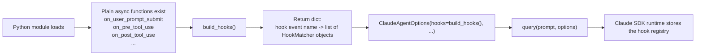
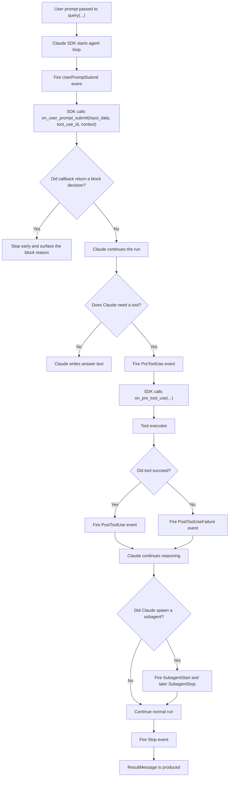

# `claude_hooks_monitor.py` Explained

File:

- [claude_hooks_monitor.py](/Users/sravanjosh/Documents/Aiceberg/cluade_sdk/src/claude_hooks_monitor.py)

This note is focused on one question:

- what exactly is happening inside `claude_hooks_monitor.py`

It is intentionally plain-English and visual.

## The shortest mental model

A hook in this file means:

- Claude reaches a named event in the agent loop
- the SDK looks up which Python callback function was registered for that event
- the SDK calls that function
- the function returns a small JSON-shaped decision object

So the main pattern is:

- define callback functions
- group them into a hook registry
- pass that registry to `ClaudeAgentOptions`
- call `query(...)`
- let the SDK invoke your callbacks later when events happen

## Flowchart 1: Registration Time

This is what happens before Claude starts answering.



## Flowchart 2: Runtime Event Flow

This is what happens after `query(...)` starts the run.



## Flowchart 3: The Exact Registration Shape In This File

This is the most important object in the file.

```mermaid
flowchart TD
    A["build_hooks()"] --> B["UserPromptSubmit -> [HookMatcher(hooks=[on_user_prompt_submit])]"]
    A --> C["PreToolUse -> [HookMatcher(hooks=[on_pre_tool_use])]"]
    A --> D["PostToolUse -> [HookMatcher(hooks=[on_post_tool_use])]"]
    A --> E["PostToolUseFailure -> [HookMatcher(hooks=[on_post_tool_use_failure])]"]
    A --> F["Stop -> [HookMatcher(hooks=[on_stop])]"]
    A --> G["SubagentStart -> [HookMatcher(hooks=[on_subagent_start])]"]
    A --> H["SubagentStop -> [HookMatcher(hooks=[on_subagent_stop])]"]
    A --> I["PreCompact -> [HookMatcher(hooks=[on_pre_compact])]"]
    A --> J["Notification -> [HookMatcher(hooks=[on_notification])]"]
    A --> K["PermissionRequest -> [HookMatcher(hooks=[on_permission_request])]"]
```



## What "callback function" means here

A callback is just:

- a function you hand to the SDK now
- so the SDK can call it later

That is why this works:

```python
HookMatcher(hooks=[on_pre_tool_use])
```

You are passing the function itself, not calling it yet.

This would be wrong:

```python
HookMatcher(hooks=[on_pre_tool_use()])
```

because that would run the function immediately during setup instead of registering it for later.

## What the "loose functions" are

These are plain top-level functions in the file. They are not methods on a class.

That is normal Python.

In this file, they fall into three groups.

### 1. Hook callback functions

These are the functions Claude may call during the run:

- `on_user_prompt_submit`
- `on_pre_tool_use`
- `on_post_tool_use`
- `on_post_tool_use_failure`
- `on_stop`
- `on_subagent_start`
- `on_subagent_stop`
- `on_pre_compact`
- `on_notification`
- `on_permission_request`

### 2. Shared helper functions

These are not registered as hooks. They support the callbacks:

- `json_safe`
- `initialize_run_dir`
- `write_summary`
- `append_jsonl`
- `log_hook`
- `log_message`
- `find_blocked_word`
- `print_message`

### 3. Orchestration functions

These wire the whole run together:

- `build_hooks`
- `run_prompt`
- `main`

## Why `HookMatcher` exists

`HookMatcher` is not the hook event itself.

It is a small SDK configuration object that says:

- which callback functions belong under this event
- whether there is an optional matcher filter
- whether there is an optional timeout

In this file, every registration looks like:

```python
"PreToolUse": [HookMatcher(hooks=[on_pre_tool_use])]
```

That means:

- hook event bucket = `PreToolUse`
- matcher filter = none
- callbacks to run = `on_pre_tool_use`

Because no `matcher=` is given here, this file is saying:

- run the callback for every event in that bucket

Example:

- every `PreToolUse` event calls `on_pre_tool_use`
- every `Stop` event calls `on_stop`

If you wanted to only watch Bash tool calls, the shape would be more like:

```python
"PreToolUse": [HookMatcher(matcher="Bash", hooks=[on_pre_tool_use])]
```

Then the callback would run only when the tool name matched `Bash`.

## Why we are not "registering to HookMatcher"

The more accurate wording is:

- we create `HookMatcher` objects
- then we register the whole hook map in `ClaudeAgentOptions(hooks=...)`

So `HookMatcher` is one piece inside the registration map.

The actual registration happens when `build_hooks()` is passed into:

```python
options = ClaudeAgentOptions(
    hooks=build_hooks(),
    ...
)
```

## How the SDK knows which callback to call

At a high level, it knows from two things:

- the hook event name, such as `UserPromptSubmit`
- the callback list stored inside the `HookMatcher`

So the runtime logic is roughly:

1. an event fires
2. the SDK looks up that event name in the `hooks` dictionary
3. it checks the matchers under that event
4. it runs the callback functions for the matchers that apply

In this file, because every matcher is very broad, each event bucket has one obvious callback.

Example:

- event name `PostToolUse`
- SDK finds `hooks["PostToolUse"]`
- that list contains `HookMatcher(hooks=[on_post_tool_use])`
- so the SDK calls `on_post_tool_use(...)`

## Why the function is named `build_hooks()`

`build_hooks()` is a good name because it builds and returns the hook registry.

It does not itself handle any runtime event.

That is why a name like `simplehookhandler()` would be misleading:

- `handler` sounds like a function that runs when an event fires
- but `build_hooks()` runs once during setup and returns configuration

So the naming split in this file is actually clean:

- `on_pre_tool_use` is a runtime handler
- `build_hooks` is a setup helper

## What each callback receives

Each hook callback in this file has the same signature:

```python
async def some_hook(
    input_data: dict[str, Any], tool_use_id: str | None, context: HookContext
) -> HookJSONOutput:
```

Very plain-English meaning:

- `input_data`: the payload for this event
- `tool_use_id`: a correlation ID for tool-related events, or `None`
- `context`: extra hook context from the SDK

In this file, many callbacks do:

```python
del context
```

That just means:

- the function received `context`
- this example does not need it
- deleting it avoids an unused-variable warning and makes the example feel intentional

In `on_user_prompt_submit`, the file also does:

```python
del context
```

and then reads from `input_data["prompt"]`.

## What each callback returns

Most callbacks in this file return:

```python
{}
```

That means:

- observe and log the event
- do not modify or block anything

Only `on_user_prompt_submit(...)` sometimes returns a block result:

```python
{
    "decision": "block",
    "reason": reason,
    "systemMessage": reason,
}
```

That means:

- stop the run early
- record why
- surface the reason back into the runtime

## The simplest way to read the file top to bottom

### Section A: setup and logging helpers

The first part of the file creates a run directory and JSONL logs:

- `initialize_run_dir`
- `write_summary`
- `append_jsonl`
- `log_hook`
- `log_message`

These functions are not part of Claude's hook API.
They are your own local observability layer.

### Section B: one small local rule

`find_blocked_word` looks for:

- `hurt`
- `hunt`
- `harm`

This is only used by `on_user_prompt_submit`.

### Section C: hook callbacks

Each `on_*` function is one callback that Claude may invoke.

Most of them do exactly two things:

- call `log_hook(...)`
- return `{}`

That makes this file a very good learning example, because the hook behavior is mostly transparent logging.

### Section D: hook registration

`build_hooks()` is the bridge from plain Python functions to Claude's runtime hook system.

Without `build_hooks()`, the callback functions would just be ordinary Python functions sitting in the file unused.

### Section E: runtime launch

`run_prompt()` does the key setup:

- creates the run directory
- builds `ClaudeAgentOptions`
- passes `hooks=build_hooks()`
- starts `query(prompt=prompt, options=options)`
- logs streamed SDK messages

This is where your local code hands control to the Claude SDK.

## Two good prompts for exploring this file

These match the runbook in [claude_hooks_monitor.md](/Users/sravanjosh/Documents/Aiceberg/cluade_sdk/docs/claude_hooks_monitor.md).

### Prompt 1: no tools

```text
Hi Claude. Please reply in one short friendly sentence about what hooks are. Do not read files, search the repo, or use any tools.
```

Best for learning:

- `UserPromptSubmit`
- `Stop`

This gives you the clean baseline.

### Prompt 2: with tools

```text
Please use the Read and Glob tools to inspect this workspace. Find the hook registration in claude_hooks_monitor.py and tell me which hook names are registered.
```

Best for learning:

- `PreToolUse`
- `PostToolUse`
- `tool_use_id`
- tool payload structure in `input_data`

This gives you the tool lifecycle.

## What to look for in the logs

After each run, open:

- `runs/entire_log_run_<timestamp>/hook_events.jsonl`
- `runs/entire_log_run_<timestamp>/sdk_messages.jsonl`
- `runs/entire_log_run_<timestamp>/summary.json`

Useful comparisons:

- which hook names appeared
- how many times each hook appeared
- whether `tool_use_id` is empty or populated
- what fields exist in `input_data` for prompt hooks versus tool hooks
- how the SDK message stream is richer than the hook log

## Source-backed points versus local inference

The following are directly supported by Anthropic's current docs:

- hooks are callback functions that run in response to agent events
- `ClaudeAgentOptions(hooks=...)` is how Python registers hooks
- `HookMatcher` has `matcher`, `hooks`, and `timeout`
- Python supports `PreToolUse`, `PostToolUse`, `PostToolUseFailure`, `UserPromptSubmit`, `Stop`, `SubagentStart`, `SubagentStop`, `PreCompact`, `Notification`, and `PermissionRequest`
- every hook callback receives `input_data`, `tool_use_id`, and `context`

The following are local conclusions from reading this file together with those docs:

- `build_hooks()` is named well because it builds configuration rather than handling runtime events
- the file uses broad matchers because no `matcher=` field is provided
- most callbacks are intentionally no-op observers because they return `{}`
- this file is designed more as a hook explorer than as a policy engine

## Sources

Verified on March 25, 2026:

- Anthropic hooks guide: [platform.claude.com/docs/en/agent-sdk/hooks](https://platform.claude.com/docs/en/agent-sdk/hooks)
- Anthropic Python SDK reference: [platform.claude.com/docs/en/agent-sdk/python](https://platform.claude.com/docs/en/agent-sdk/python)
- Anthropic agent loop guide: [platform.claude.com/docs/en/agent-sdk/agent-loop](https://platform.claude.com/docs/en/agent-sdk/agent-loop)
- Anthropic Python SDK repo README with hook example: [github.com/anthropics/claude-agent-sdk-python](https://github.com/anthropics/claude-agent-sdk-python)

